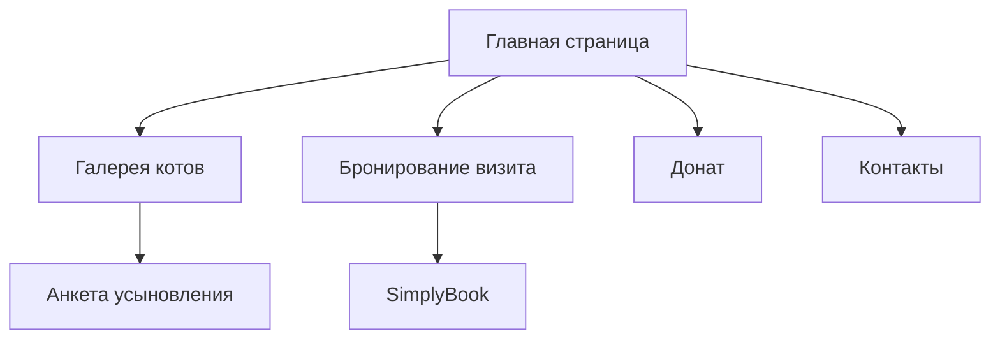

## 1. Обзор продукта

Мяурум — это уникальное пространство в Харькове, объединяющее кото-кафе и приют для бездомных кошек. Основная миссия — поиск дома для животных и создание уютного пространства для отдыха людей.

Проект работает в партнерстве с благотворительным фондом "BlueCross for Cats", обеспечивая прозрачность и доверие. Бизнес-модель: посетители платят за время пребывания в формате тайм-кафе или делают донаты, все средства идут на содержание животных.

## 2. Основные функции

### 2.1 Пользовательские роли
| Роль | Метод регистрации | Основные права |
|------|-------------------|----------------|
| Гость | Не требуется | Просмотр информации, бронирование визита |
| Волонтер | Через контактную форму | Дополнительная информация о волонтерстве |
| Потенциальный усыновитель | Через анкету усыновления | Возможность подать заявку на усыновление |

### 2.2 Модули функций

Сайт Мяурум состоит из следующих основных страниц:
1. **Главная страница**: герой-секция, о нас, услуги, донат-блок
2. **Наши котики**: галерея котов для усыновления, фильтры по параметрам
3. **Посетить нас**: правила посещения, стоимость, бронирование
4. **Поддержать**: способы доната, реквизиты, прогресс сборов
5. **Контакты**: адрес, телефон, карта, социальные сети

### 2.3 Детали страниц

| Название страницы | Название модуля | Описание функции |
|-------------------|------------------|------------------|
| Главная страница | Герой-секция | Показать полноэкранное видео/фото интерьера с котами, заголовок "Мяурум: Больше, чем просто кафе", кнопки бронирования и усыновления |
| Главная страница | О нас | Описать концепцию Shelter + Anti-cafe, упомянуть партнерство с BlueCross for Cats, подчеркнуть безопасность и уют |
| Главная страница | Услуги | Объяснить формат тайм-кафе, правила посещения, показать стоимость и ссылку на бронирование |
| Главная страница | Донат-блок | Призыв помочь, показать реквизиты Monobank/PayPal, прогресс текущих сборов |
| Наши котики | Галерея котов | Сетка карточек с фото, именем, возрастом, характером каждого кота, кнопка "Познакомиться" |
| Наши котики | Фильтры | Фильтрация по возрасту, полу, характеру для удобного поиска |
| Посетить нас | Правила посещения | Краткое описание правил: не будить спящих, мыть руки, сменная обувь |
| Посетить нас | Бронирование | Интеграция виджета SimplyBook или ссылка на внешнюю систему бронирования |
| Поддержать | Способы помощи | Описание различных способов доната: финансовая помощь, волонтерство, покупка товаров |
| Поддержать | Прогресс сборов | Визуализация текущих нужд приюта и собранных средств |
| Контакты | Контактная информация | Адрес: вул. Культури, 23, Харків, 61000, телефон: +380 66 173 2463, график работы |
| Контакты | Интерактивная карта | Встроенная Google Maps с меткой местоположения |
| Контакты | Социальные сети | Ссылки на Instagram и TikTok приюта |

## 3. Основные процессы

### Поток гостя
Гость заходит на сайт → Ознакамливается с концепцией на главной → Переходит к галерее котов или странице бронирования → Бронирует визит через SimplyBook или заполняет анкету на усыновление → Получает подтверждение на email.

### Поток усыновителя
Пользователь выбирает кота в галерее → Нажимает "Познакомиться" → Заполняет анкету усыновления → Получает обратную связь от команды приюта → Организует встречу с котом.

## 4. Дизайн интерфейса

### 4.1 Стиль дизайна
- **Цветовая палитра**: Основной синий (#2C5F8D) из логотипа, желтый (#FFD700) для акцентов, кремовый (#F5F5DC) для фона, белый для карточек
- **Типографика**: Чистый гротеск (Inter, Roboto) для заголовков, читабельный sans-serif для основного текста
- **Кнопки**: Скругленные углы, 3D-эффект при наведении, синий цвет с желтыми акцентами
- **Макет**: Карточная система, верхняя навигация с липкой фиксацией
- **Иконки**: Минималистичные линейные иконки с округлыми формами

### 4.2 Обзор страниц

| Название страницы | Название модуля | UI элементы |
|-------------------|------------------|-------------|
| Главная страница | Герой-секция | Полноэкранное видео с затемнением, белый заголовок 48px, подзаголовок 24px, две кнопки CTA с желтым цветом |
| Главная страница | О нас | Светлый фон, иконки в кругах, текст 18px, межстрочный интервал 1.5 |
| Главная страница | Галерея котов | Сетка 3x2 на десктопе, карточки с тенью, фото 1:1, имя жирным 20px |
| Наши котики | Фильтры | Круглые кнопки-табы, активный синий, неактивный светло-серый |
| Посетить нас | Правила | Нумерованный список с иконками, текст 16px, отступы 20px |
| Поддержать | Донат-блок | Яркий желтый фон, прогресс-бар синий, кнопки оплаты с логотипами |

### 4.3 Адаптивность
Mobile-first подход с прогрессивным улучшением для десктопа. Тач-оптимизация: увеличенные кнопки, свайп-жесты для галереи, оптимизированная загрузка изображений через srcset.

### 4.4 SEO и производительность
- Мета-теги для запросов "котокафе Харьков", "приют кошек Харьков"
- Оптимизация изображений через WebP, ленивая загрузка
- Структурированные данные для локального бизнеса
- Микроразметка для отзывов и контактов