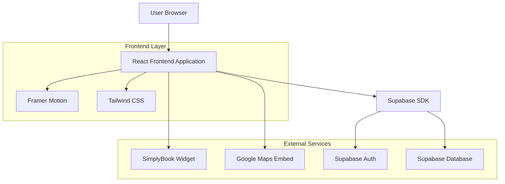

## 1. Архитектура проекта



## 2. Описание технологий

* **Frontend**: React\@18 + Tailwind CSS\@3 + Framer Motion

* **Инструмент инициализации**: vite-init

* **Backend**: None (используем Supabase для аутентификации и базы данных)

* **Database**: Supabase (PostgreSQL)

* **External Services**: SimplyBook (бронирование), Google Maps (карта)

## 3. Определение маршрутов

| Маршрут   | Назначение                                                       |
| --------- | ---------------------------------------------------------------- |
| /         | Главная страница с герой-секцией, о нас, услугами и донат-блоком |
| /cats     | Страница галереи котов для усыновления с фильтрами               |
| /visit    | Страница с правилами посещения и информацией о бронировании      |
| /donate   | Страница способов поддержки и доната                             |
| /contacts | Контактная информация и интерактивная карта                      |

## 4. Компонентная архитектура

### 4.1 Основные компоненты

**Layout Components**

* `Header`: Навигация, логотип, CTA кнопка бронирования

* `Footer`: Контакты, социальные сети, карта, копирайт

* `Navigation`: Мобильное и десктопное меню

**Page Components**

* `HeroSection`: Полноэкранное видео/фото, заголовок, CTA кнопки

* `AboutSection`: Описание концепции, иконки преимуществ

* `CatsGallery`: Сетка карточек котов, фильтры, пагинация

* `CatCard`: Карточка кота с фото, именем, возрастом, характером

* `VisitRules`: Список правил посещения с иконками

* `DonationBlock`: Прогресс-бар, способы оплаты, призыв к действию

* `ContactInfo`: Адрес, телефон, часы работы, социальные сети

**UI Components**

* `Button`: Стилизованные кнопки с hover-эффектами

* `Card`: Карточки с тенью и скругленными углами

* `ProgressBar`: Визуализация прогресса сбора средств

* `Modal`: Модальные окна для анкет и форм

### 4.2 Анимации и интеракции

**Framer Motion используется для:**

* Плавная прокрутка секций

* Анимация появления карточек при скролле

* Hover-эффекты на кнопках и карточках

* Мобильное меню с анимацией

* Загрузка изображений с эффектом fade-in

## 5. Структура проекта

```
src/
├── components/
│   ├── layout/
│   │   ├── Header.jsx
│   │   ├── Footer.jsx
│   │   └── Navigation.jsx
│   ├── sections/
│   │   ├── HeroSection.jsx
│   │   ├── AboutSection.jsx
│   │   ├── CatsGallery.jsx
│   │   ├── VisitRules.jsx
│   │   └── DonationBlock.jsx
│   ├── ui/
│   │   ├── Button.jsx
│   │   ├── Card.jsx
│   │   ├── ProgressBar.jsx
│   │   └── Modal.jsx
│   └── cards/
│       └── CatCard.jsx
├── pages/
│   ├── Home.jsx
│   ├── Cats.jsx
│   ├── Visit.jsx
│   ├── Donate.jsx
│   └── Contacts.jsx
├── hooks/
│   ├── useScrollAnimation.js
│   └── useMediaQuery.js
├── utils/
│   ├── constants.js
│   └── helpers.js
├── styles/
│   └── globals.css
└── App.jsx
```

## 6. Система стилей

### 6.1 Цветовая палитра (Tailwind CSS)

```javascript
// tailwind.config.js
module.exports = {
  theme: {
    extend: {
      colors: {
        primary: {
          50: '#e6f0f7',
          500: '#2C5F8D', // Основной синий из логотипа
          600: '#24507a',
          700: '#1c4067',
        },
        accent: {
          400: '#FFD700', // Желтый из логотипа
          500: '#FFC700',
        },
        neutral: {
          50: '#F5F5DC', // Кремовый фон
          100: '#f4f4f0',
          900: '#1a1a1a',
        }
      },
      fontFamily: {
        sans: ['Inter', 'system-ui', 'sans-serif'],
        display: ['Roboto', 'sans-serif'],
      },
      animation: {
        'fade-in': 'fadeIn 0.6s ease-in-out',
        'slide-up': 'slideUp 0.4s ease-out',
      }
    }
  }
}
```

### 6.2 Типографика

* **Заголовки**: Roboto Bold, размеры от 32px до 48px

* **Основной текст**: Inter Regular, 16-18px

* **Кнопки**: Inter Medium, 16px, заглавные буквы

* **Мобильные заголовки**: 24-32px для оптимального чтения

## 7. Оптимизация производительности

### 7.1 Изображения

* Использование WebP формата с fallback на JPEG

* Ленивая загрузка через Intersection Observer

* Responsive images через srcset

* Оптимизация размера: максимум 800px для галереи, 1920px для hero

### 7.2 Код сплиттинг

* Динамический импорт для сторонних библиотек

* Разделение кода по маршрутам

* Оптимизация bundle размера

### 7.3 Кэширование

* Service Worker для офлайн-работы

* Кэширование статических ресурсов

* Оптимизация повторных визитов

## 8. SEO и доступность

### 8.1 SEO оптимизация

* Мета-теги для каждой страницы

* Структурированные данные (Schema.org)

* Семантическая HTML разметка

* Оптимизация для локального поиска

### 8.2 Доступность

* ARIA лейблы для интерактивных элементов

* Клавиатурная навигация

* Поддержка screen readers

* Контрастность цветов WCAG 2.1 AA

## 9. Интеграции

### 9.1 SimplyBook

```javascript
// Компонент для интеграции SimplyBook
const SimplyBookWidget = () => {
  useEffect(() => {
    const script = document.createElement('script');
    script.src = 'https://simplybook.it/widget/widget.js';
    script.async = true;
    document.body.appendChild(script);
  }, []);

  return <div id="simplybook-widget" />;
};
```

### 9.2 Google Maps

```javascript
// Компонент для Google Maps
const GoogleMapEmbed = () => (
  <iframe
    src="https://www.google.com/maps/embed?pb=!1m18!1m12!1m3!1d2562.1234567!2d36.2304!3d50.0047!2m3!1f0!2f0!3f0!3m2!1i1024!2i768!4f13.1!3m3!1m2!1s0x0%3A0x0!2zNTDCsDAwJzE3LjAiTiAzNsKwMTMnNDkuNCJF!5e0!3m2!1sru!2sua!4v1234567890"
    width="100%"
    height="400"
    style={{ border: 0 }}
    allowFullScreen=""
    loading="lazy"
  />
);
```

## 10. Развертывание

### 10.1 Сборка

```bash
# Production build
npm run build

# Preview production build
npm run preview
```

### 10.2 Оптимизация для production

* Минификация CSS и JavaScript

* Оптимизация изображений

* Удаление неиспользуемого кода

* Сжатие

