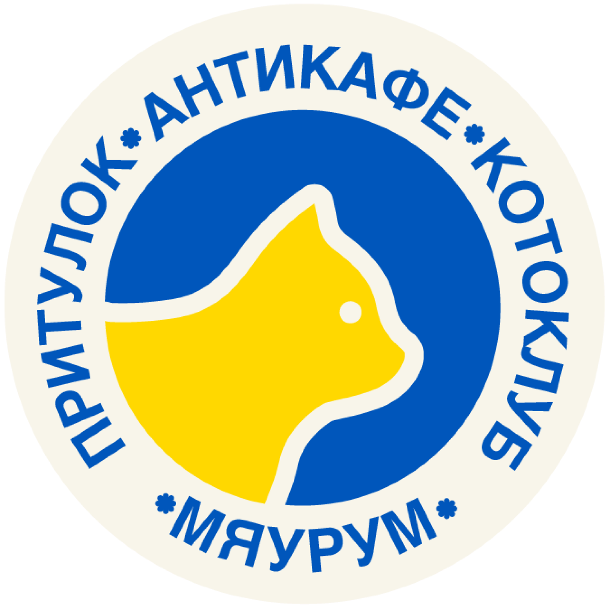

# 🐾 Meowroom - Cat Shelter & Anticafe



**Meowroom** is a heartwarming web application dedicated to the "Meowroom" cat shelter and the "BlueCross for Cats" charitable foundation based in Kharkiv, Ukraine. This platform connects compassionate people with cats looking for loving homes, facilitates donations, and provides essential information about the unique anticafe format where guests can interact with rescued cats.

## ✨ Features

- **🏠 Home & Hero Section**: A welcoming introduction to the shelter's mission with beautiful visuals.
- **🐱 Cats Gallery**: An interactive catalog of current residents with details about their age, gender, and personality.
- **📖 About Us**: The touching story of founders Vitaliy and Veronika Fatsky, featuring video presentations and media coverage.
- **💖 Donation System**: Easy-to-access donation options supporting multiple payment methods (Monobank, PayPal, etc.).
- **📅 Visit Information**: Comprehensive guide on visiting rules, booking procedures, and location details.
- **📱 Responsive Design**: A modern, mobile-first interface built with Tailwind CSS.
- **🎨 Smooth Animations**: Engaging user experience powered by Framer Motion.

## 🛠️ Tech Stack

This project is built with a modern frontend stack to ensure performance, type safety, and ease of development:

- **Framework**: [React](https://react.dev/)
- **Language**: [TypeScript](https://www.typescriptlang.org/)
- **Build Tool**: [Vite](https://vitejs.dev/)
- **Styling**: [Tailwind CSS](https://tailwindcss.com/)
- **Animations**: [Framer Motion](https://www.framer.com/motion/)
- **Routing**: [React Router](https://reactrouter.com/)
- **Icons**: [Lucide React](https://lucide.dev/)
- **State Management**: [Zustand](https://zustand-demo.pmnd.rs/)

## 🚀 Getting Started

Follow these steps to set up the project locally on your machine.

### Prerequisites

- Node.js (v18 or higher)
- npm or yarn

### Installation

1.  **Clone the repository**
    ```bash
    git clone https://github.com/Menta1ik/meowroom.git
    cd meowroom
    ```

2.  **Install dependencies**
    ```bash
    npm install
    ```

3.  **Start the development server**
    ```bash
    npm run dev
    ```

4.  **Open in your browser**
    Visit `http://localhost:5173` to view the application.

## 📂 Project Structure

```
src/
├── assets/          # Static assets
├── components/      # Reusable UI components
│   ├── cards/       # Card components (e.g., CatCard)
│   ├── layout/      # Layout components (Header, Footer)
│   ├── sections/    # Page sections
│   └── ui/          # Basic UI elements (Buttons, Inputs)
├── data/            # Mock data and constants
├── hooks/           # Custom React hooks
├── lib/             # Utility functions
├── pages/           # Application pages (Home, About, Cats, etc.)
└── App.tsx          # Main application component
```

## 🤝 Contributing

Contributions are welcome! If you'd like to help improve Meowroom, please feel free to:

1.  Fork the repository.
2.  Create a feature branch (`git checkout -b feature/AmazingFeature`).
3.  Commit your changes (`git commit -m 'Add some AmazingFeature'`).
4.  Push to the branch (`git push origin feature/AmazingFeature`).
5.  Open a Pull Request.

## 💙 Support the Shelter

The primary goal of this project is to support the "BlueCross for Cats" foundation.
If you find this project inspiring, please consider donating to the shelter directly through the website or sharing it with others.

---

*"We are responsible for those who we have tamed."*
